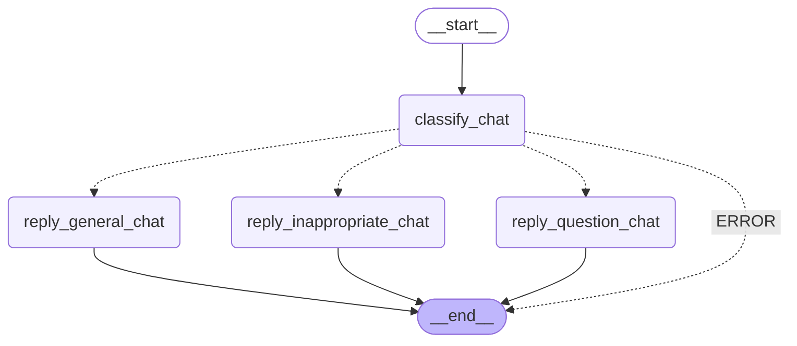

# DDD AI

## Env Setup

```bash
cp env.template.sh env.sh
source ./env.sh
```

## versions

python: 3.12

## chat_graph


```mermaid
graph TD;
	__start__([<p>__start__</p>]):::first
	classify_chat(classify_chat)
	reply_general_chat(reply_general_chat)
	reply_question_chat(reply_question_chat)
	reply_inappropriate_chat(reply_inappropriate_chat)
	__end__([<p>__end__</p>]):::last
	__start__ --> classify_chat;
	reply_general_chat --> __end__;
	reply_inappropriate_chat --> __end__;
	reply_question_chat --> __end__;
	classify_chat -.-> reply_general_chat;
	classify_chat -.-> reply_question_chat;
	classify_chat -.-> reply_inappropriate_chat;
	classify_chat -. &nbsp;ERROR&nbsp; .-> __end__;
	classDef default fill:#f2f0ff,line-height:1.2
	classDef first fill-opacity:0
	classDef last fill:#bfb6fc
```